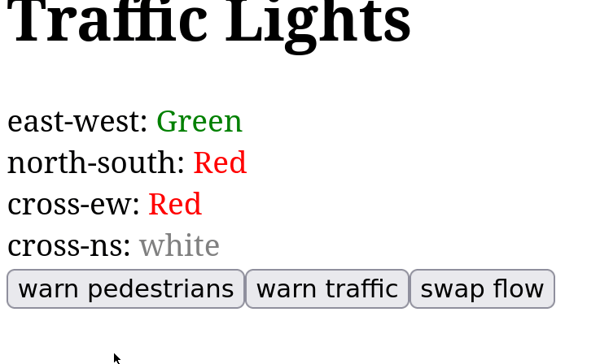

# Electric + Clj-Statecharts Demo

Copy of [Electric + Statecharts Demo](https://github.com/roterski/electric-statecharts-demo), demonstrating [clj-statecharts](https://github.com/lucywang000/clj-statecharts) instead of [fulcrologic/statecharts](https://github.com/fulcrologic/statecharts) with [hyperfiddle/electric](https://github.com/hyperfiddle/electric).

It implements [fulcrologic/statecharts's traffic-light example](https://github.com/fulcrologic/statecharts/blob/main/src/examples/traffic_light.cljc):

## What are state charts and why
A good resource on state charts: https://statecharts.dev/

## Setup
This repo is forked from [hyperfiddle/electric-starter-app](https://github.com/hyperfiddle/electric-starter-app) so please refer to it for usage instructions.
